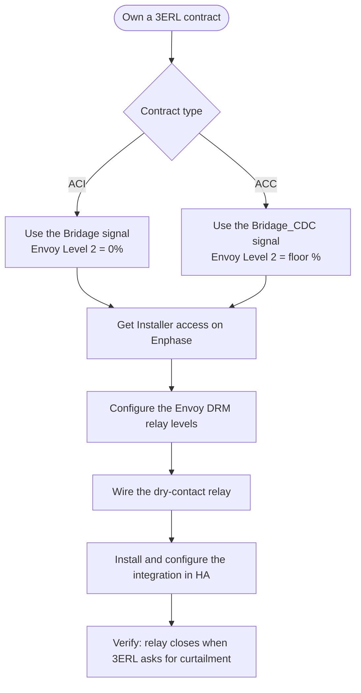
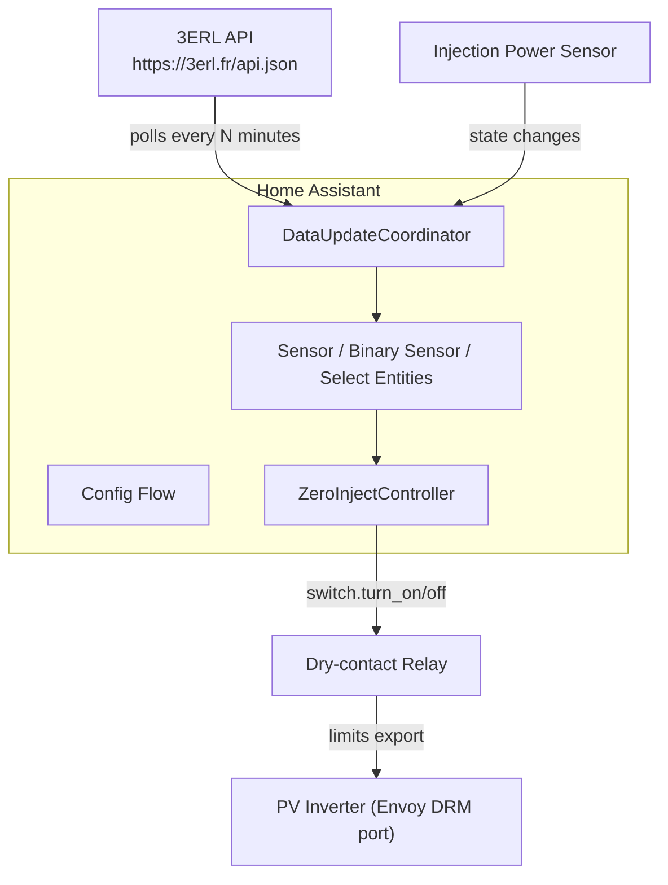
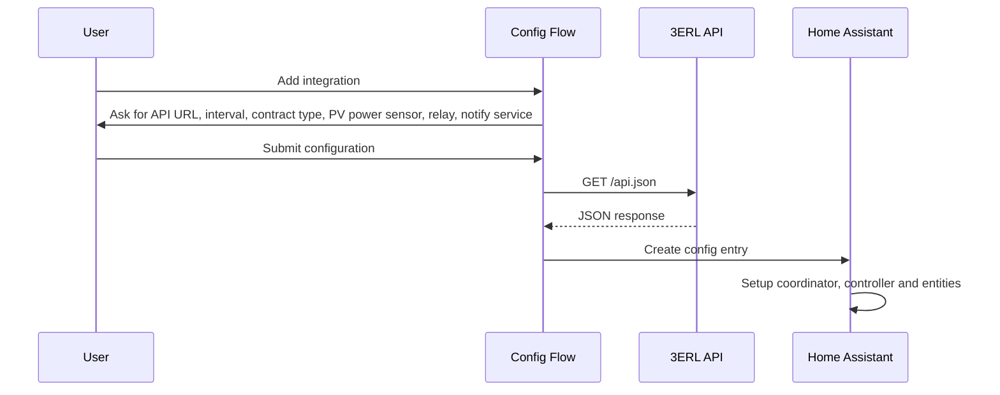
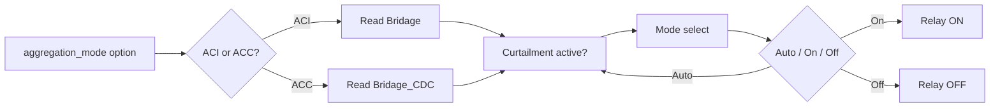
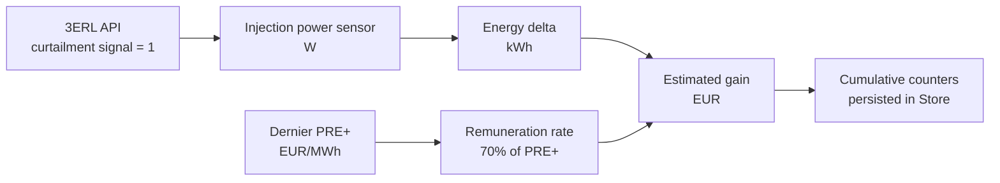

# 3ERL Zero-Injection workflow

This document describes the architecture, data flow and operational workflow of the 3ERL Zero-Injection integration.

## End-to-end setup



## Architecture overview



## Configuration flow



## Signal selection

The configured contract type selects the API field that drives the relay.



## Zero-injection state machine

The controller re-evaluates whenever the mode select or the curtailment signal changes.

```mermaid
stateDiagram-v2
    [*] --> Inactive

    state Inactive {
        [*] --> choose
        state choose <<choice>>
        choose --> Active: mode = On or (mode = Auto and signal = 1)
        choose --> Inactive: mode = Off or (mode = Auto and signal = 0)
    }

    state Active {
        [*] --> choose2
        state choose2 <<choice>>
        choose2 --> Inactive: mode = Off or (mode = Auto and signal = 0)
        choose2 --> Active: mode = On or (mode = Auto and signal = 1)
    }

    Inactive --> Active
    Active --> Inactive
```

## Curtailment and remuneration calculation



## Operational workflow

1. The user installs the integration via HACS or manual copy, then configures it through the Home Assistant UI.
2. The coordinator fetches the 3ERL API at the configured interval.
3. Each time the configured injection power sensor changes, the coordinator computes the energy curtailed since the last update.
4. The controller listens to coordinator updates and mode-select changes, then decides whether to turn the relay on or off.
5. While curtailment is active, the coordinator accumulates the estimated gain using the latest PRE+ value and the 70% remuneration rule.
6. Cumulative energy and gain counters are saved to Home Assistant storage and restored on restart.

## Maintenance workflow

- To reset counters, call the service `zero_inject_3erl.reset_counters` from **Developer Tools → Services**.
- To change the relay, PV sensor, contract type or polling interval, use **Settings → Devices & services → 3ERL Zero-Injection → Configure**.
