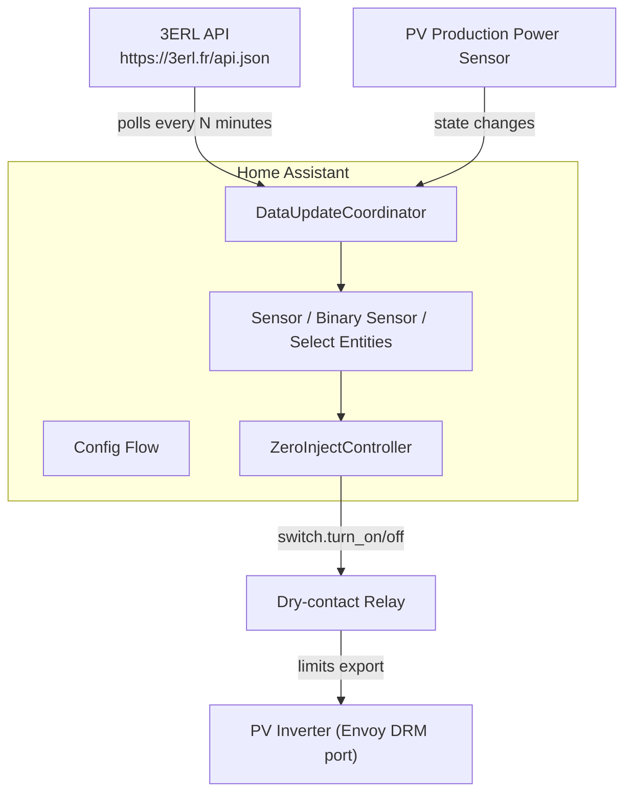
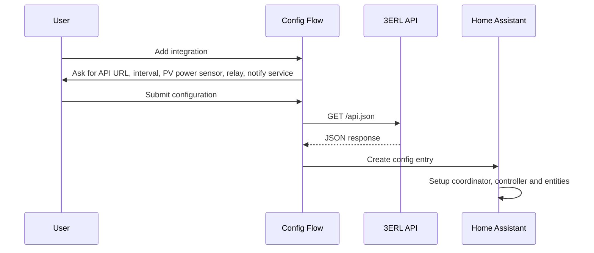
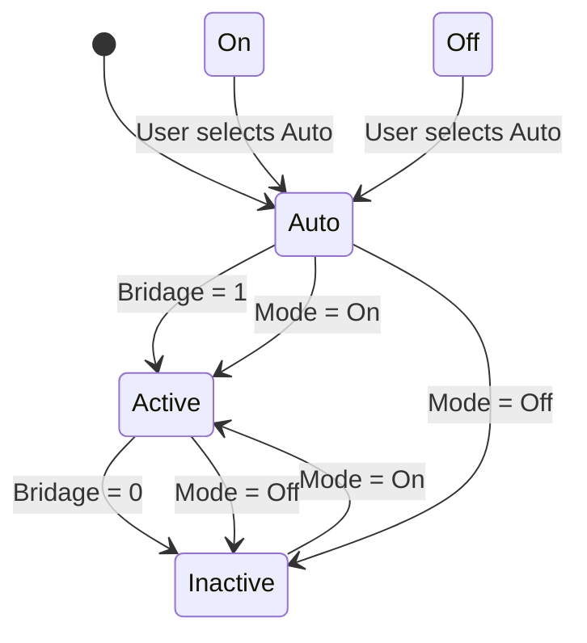
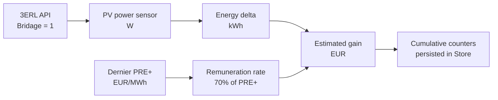

# 3ERL Zero-Injection Workflow

This document describes the architecture, data flow and operational workflow of the 3ERL Zero-Injection integration.

## Architecture overview

## Configuration flow

## Zero-injection state machine

## Curtailment and remuneration calculation

## Operational workflow

1. **Initial setup**: User installs the integration via HACS or manual copy, then configures it through the Home Assistant UI.
2. **API polling**: The coordinator fetches the 3ERL API at the configured interval.
3. **Power tracking**: Each time the configured PV production power sensor changes, the coordinator computes the energy curtailed since the last update.
4. **Decision**: The controller listens to coordinator updates and mode-select changes, then decides whether to turn the relay on or off.
5. **Remuneration**: While curtailment is active, the coordinator accumulates the estimated gain using the latest PRE+ value and the 70% remuneration rule.
6. **Persistence**: Cumulative energy and gain counters are saved to Home Assistant storage and restored on restart.

## Maintenance workflow

- To reset counters, call the service `zero_inject_3erl.reset_counters` from **Developer Tools → Services**.
- To change the relay, PV sensor or polling interval, use **Settings → Devices & services → 3ERL Zero-Injection → Configure**.
