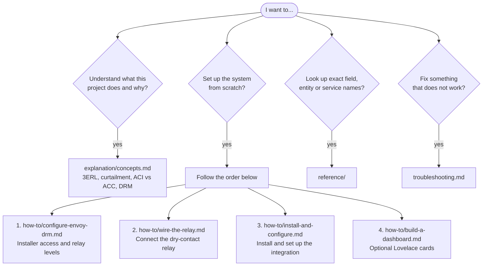

# Documentation

This documentation follows the [Diátaxis](https://diataxis.fr/) structure. Pick the page that matches what you need right now.

| I need to... | Go to |
|---|---|
| Understand 3ERL, curtailment, ACI vs ACC and how the relay stops export | [explanation/concepts.md](explanation/concepts.md) |
| Get Installer access on Enphase and configure the DRM relay levels | [how-to/configure-envoy-drm.md](how-to/configure-envoy-drm.md) |
| Wire a dry-contact relay to the Envoy DRM port | [how-to/wire-the-relay.md](how-to/wire-the-relay.md) |
| Install and configure the integration in Home Assistant | [how-to/install-and-configure.md](how-to/install-and-configure.md) |
| Add dashboard cards | [how-to/build-a-dashboard.md](how-to/build-a-dashboard.md) |
| Look up configuration fields | [reference/configuration-options.md](reference/configuration-options.md) |
| Look up the created entities | [reference/entities.md](reference/entities.md) |
| Look up the 3ERL API fields | [reference/api-fields.md](reference/api-fields.md) |
| Look up the exposed services | [reference/services.md](reference/services.md) |
| Diagnose a problem | [troubleshooting.md](troubleshooting.md) |
| Understand the internal architecture | [../WORKFLOW.md](../WORKFLOW.md) |
