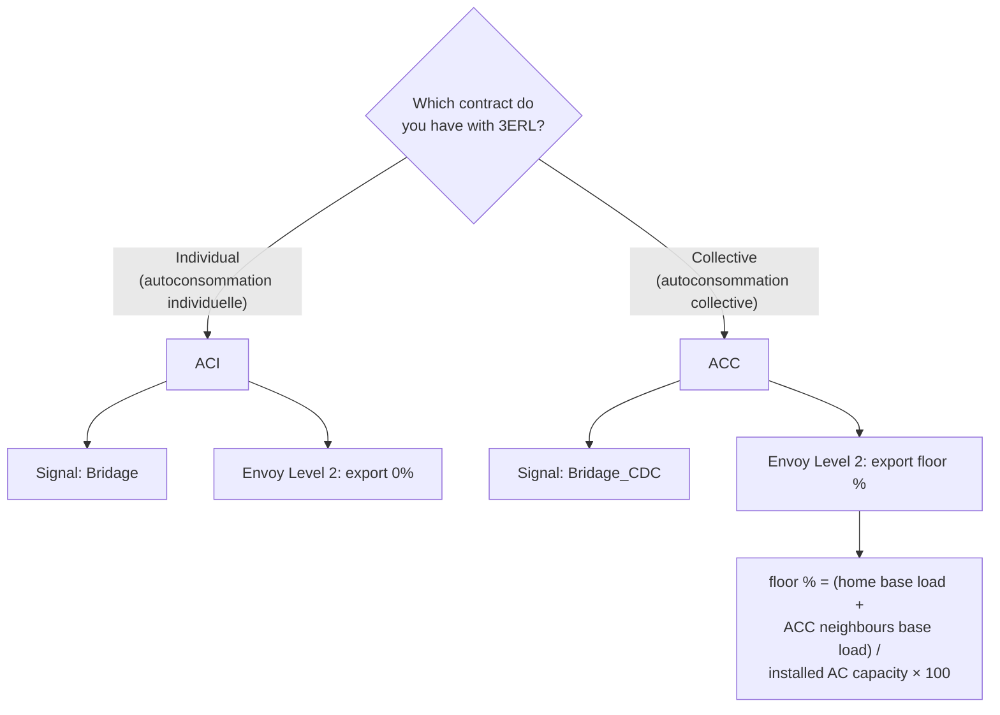

# How 3ERL zero-injection works

This page explains the concepts behind the integration. If you want to set up the system, start with the [how-to guides](../README.md) instead.

## 3ERL and curtailment

[3ERL](https://3erl.fr) is a French association acting as a balance responsible party (Responsable d'Équilibre). It lets self-consumers sell their surplus solar power at the spot market price instead of a fixed feed-in tariff. When market prices go negative, injecting power into the grid costs money instead of earning it. 3ERL then asks its members to stop injecting.

The association publishes a public API at `https://3erl.fr/api.json`, refreshed every 15 minutes. Two fields carry the curtailment signal:

- `Bridage` — applies to individual self-consumption contracts (ACI).
- `Bridage_CDC` — applies to collective self-consumption contracts (ACC).

The integration polls this API and drives a dry-contact relay connected to the inverter. When the signal asks for curtailment, the relay closes and the inverter stops exporting.

## ACI vs ACC

Your contract type decides which API field to follow and what the inverter should do when curtailed.



Why the difference exists:

- In **ACI**, surplus energy is valued at the daily weighted average price (`PRD4`). If the average turns negative at the end of the day, every kilowatt-hour injected that day is billed at a negative price. Full export cut-off is the correct response.
- In **ACC**, surplus is valued at the quarter-hour PRE+ and the collective scheme still needs a residual injection (the "talon") to cover the members' base load. The Envoy Level 2 must leave that percentage instead of cutting to zero.

Select the matching value in the integration option **Self-consumption contract type**.

## The DRM port

Enphase Envoy gateways expose a digital input that limits production when its contact closes. The reference project calls it the DRM port. The Envoy applies a configured export level per relay state:

| Contact state | Envoy level | Export |
|---|---|---|
| Open | Level 1 | 100 % |
| Closed | Level 2 | 0 % (ACI) or the configured floor (ACC) |

This arrangement is fail-safe. If the relay, Zigbee network or Home Assistant fails, the contact opens and export returns to normal.

## How remuneration is estimated

3ERL pays 70 % of the positive imbalance settlement price (PRE+) when market prices are positive. The remaining 30 % covers the association's operating costs.

The integration integrates the estimate over time instead of multiplying a cumulative energy by the latest price.

The price used depends on the contract type:

- **ACI**: estimated daily PRE+ computed from RTE quarter-hourly PRE+ values weighted by the Enedis PRD3 profile. Because Enedis only publishes the current day's PRD3 profile after the day is over, the integration uses the profile from a configurable past day (default `-2`) as an estimate.

  ```text
  estimated_daily_PREP = sum(PREP × PRD3_factor) / sum(PRD3_factor)
  gain (€) = curtailed_energy (kWh) × estimated_daily_PREP (€/MWh) × 0.7 / 1000
  ```

- **ACC**: current quarter-hour PRE+ for the active 15-minute slot.

  ```text
  gain (€) = curtailed_energy (kWh) × current_PREP (€/MWh) × 0.7 / 1000
  ```

If the external RTE or Enedis sources are unavailable, the integration falls back to the latest `Dernier_PREP` from the 3ERL API.

Curtailed energy is an upper bound. It equals the measured injection power integrated over curtailment periods, which is why a grid-side sensor that sees every injection source (PV, wind, battery) gives the most faithful estimate.

## Related pages

- [API field reference](../reference/api-fields.md)
- [Configure the Envoy DRM port](../how-to/configure-envoy-drm.md)
- [Choose the power sensor](../how-to/install-and-configure.md#choose-the-power-sensor)
