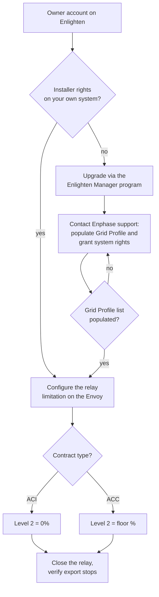

# Configure the Envoy DRM port

Goal: get Installer-level access on your Enphase system and configure the relay port so that a closed contact limits export.

## Overview



## Requirements

- An Envoy-S or IQ Gateway with a physical DRM terminal.
- A web browser.
- Installer access to the Envoy. A standard Owner account does not expose the necessary settings.

## Step 1: get Installer access

The simplest path for a homeowner is the **Enlighten Manager Upgrade Program**. Your existing Owner account works on this page.

1. Open the [Enlighten Manager Upgrade Program](https://encare.enphase.com/?upgradeProgramType=1).
2. Choose a subscription:
   - **Monthly Subscription**, 9,99 €/month.
   - **Lifetime Subscription**, 249 € one-time.
3. Complete the purchase, then log out and back in to Enlighten.

This is a third-party paid service. Prices and availability depend on your region and are subject to change. This integration is not affiliated with Enphase.

## Step 2: ask Enphase support to unlock your system

The upgrade alone may not be enough. One user reported that after purchasing, the **Grid Profile** page was editable but the profile list was empty. Enphase support fixed it live during a phone call.

Contact [Enphase support](https://enphase.com/fr-fr/contact-enphase-support) and ask for:

- Installer-level rights on your own system.
- The **Grid Profile** parameter to be available *and* populated with selectable profiles.

## Step 3: configure the relay limitation

Path in the Envoy interface: **Devices → Gateway → Limit production via relay on digital input port** (French UI: **Appareils → Passerelle → Limiter la production via relais sur Port d'entrée numérique**).

| Field | Value |
|---|---|
| Limitation target | **Export** |
| Reference value | Installed AC capacity [W] |
| Maximum capacity | Installed AC capacity in W (see below) |
| Number of relay parameters | 4 |
| Number of levels to set | 2 |
| Default limitation | 100 % |
| Sweep speed | 1000 W/sec |

### Compute the installed AC capacity

Use the maximum **continuous** AC output power of each micro-inverter, not the peak VA rating:

```text
installed_AC_capacity (W) = number_of_panels × microinverter_continuous_AC_power (W)
```

Example — 24 panels with one IQ8PLUS each:

```text
24 × 290 W = 6 960 W  →  enter 6960 in "Maximum capacity"
```

The IQ8PLUS datasheet lists 290 W continuous and 300 VA peak. 24 units peak at 7 200 W, but the continuous value is the correct reference.

### Set the relay levels

The integration drives **Relay 1**, wired between `Com` and `1/5` on the DRM port.

| Level | Relay 1 | Relay 2–4 | Export limit |
|---|---|---|---|
| Level 1 (normal) | 0 | 0 | 100 % |
| Level 2 — **ACI** | 1 | 0 | **0 %** |
| Level 2 — **ACC** | 1 | 0 | **floor %** (see below) |

For **ACC**, compute the residual floor and round up to the next whole percent:

```text
Level 2 (%) = (home_base_load_W + ACC_neighbours_base_load_W) / installed_AC_capacity_W × 100
```

Example with the 24 × IQ8PLUS system, a 200 W home base load and 500 W for the ACC neighbours: (200 + 500) / 6960 × 100 ≈ 10,06 % → **11 %**.

In ACI mode Level 2 stays at 0 %; the installed capacity only serves as the reference for the setting. See [ACI vs ACC](../explanation/concepts.md#aci-vs-acc) for the reasoning, and set the matching **Self-consumption contract type** in the integration options.

## Step 4: verify

1. Go to the Envoy web interface and check the live production/export values.
2. Close the relay. With the integration installed, set the mode select to **On**; otherwise turn the relay switch on manually.
3. Export should drop to zero (ACI) or the floor level (ACC) within a few seconds.
4. Open the relay. Export should resume after a short delay.

If export does not drop, check the [troubleshooting page](../troubleshooting.md#export-is-not-limited-when-relay-is-on).

## References

- [Enphase Enlighten](https://enlighten.enphaseenergy.com)
- [Enphase Envoy-S Installation and Operation Manual (PDF)](../assets/enphase/EnvoySMultiphase-IOM-FR.pdf)
- [Enphase Envoy-S Quick Install Guide (PDF)](../assets/enphase/Envoy-S-M-QIG-Multi-Kit-Rev05-FR-2024-01-05.pdf)
- [Enphase Envoy-S Reference Manual (PDF)](../assets/enphase/Envoy-S-MAN-EN-INTL_FR.pdf)
- [Automatisation-Bridage-3ERL-Emphase](https://github.com/ALP40/Automatisation-Bridage-3ERL-Emphase)
