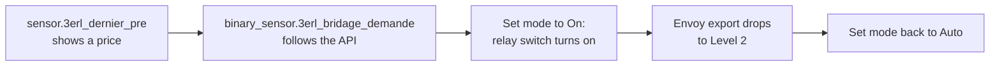

# Install and configure the integration

Goal: install `zero_inject_3erl` in Home Assistant and connect it to your relay and power sensor.

## Prerequisites

- Home Assistant 2026.9.3 or newer.
- A `switch.*` entity for the dry-contact relay, already paired and wired. See [Wire the relay](wire-the-relay.md).
- The Envoy DRM port configured. See [Configure the Envoy DRM port](configure-envoy-drm.md).
- A power sensor reporting injected power in watts (see below).

## Choose the power sensor

The integration estimates curtailed energy from this sensor during curtailment periods. Two cases:

- **PV only**: a production power sensor such as the Envoy `current_power_production` entity works.
- **Multiple injection sources** (PV, wind, a battery injecting through a VPP service like Nexen-VPP): use a **grid-side sensor** that sees total injection, for example a [ZLinky TIC](https://www.zigbee2mqtt.io/devices/ZLinky_TIC.html) module on the Linky meter. Its instantaneous injected power entity aggregates all sources; a PV-only sensor would miss battery injection.

## Install

### HACS (recommended)

1. Add `gounick/ha-zero-inject-3erl` as a custom repository in HACS and install **3ERL Zero-Injection**.
2. Restart Home Assistant.

### Manual

1. Copy `custom_components/zero_inject_3erl` into `config/custom_components`.
2. Restart Home Assistant.

## Configure

1. Go to **Settings → Devices & services → Add integration** and search for **3ERL Zero-Injection**.
2. Fill the form:

   | Field | What to enter |
   |---|---|
   | 3ERL API URL | Leave the default `https://3erl.fr/api.json`. |
   | Update interval | Polling interval in minutes (default 15, matching the API refresh). |
   | PV system type | **Generic**; reserved for future auto-detection. |
   | Self-consumption contract type | `aci` uses the `Bridage` signal, `acc` uses `Bridage_CDC`. See [ACI vs ACC](../explanation/concepts.md#aci-vs-acc). |
   | PV production power sensor | The power sensor chosen above. |
   | Zero-injection relay switch | The `switch.*` entity of your dry-contact relay. |
   | Notification service | Optional `notify.*` service for state-change notifications. |

3. Submit. The integration validates the API URL and creates the entities listed in the [entities reference](../reference/entities.md).

All fields remain editable later under **Settings → Devices & services → 3ERL Zero-Injection → Configure**. The full field list is in [configuration options](../reference/configuration-options.md).

## Verify

1. Check that `sensor.zero_inject_3erl_dernier_pre` reports a value after the first poll.
2. Set the mode select to **On**: the relay closes and export stops.
3. Set the mode back to **Auto**: the relay opens.

If something fails, see [troubleshooting](../troubleshooting.md).
