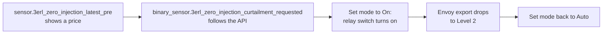

# Install and configure the integration

Goal: install `zero_inject_3erl` in Home Assistant and connect it to your relay and power sensor.

## Prerequisites

- Home Assistant 2026.9.3 or newer.
- A `switch.*` entity for the dry-contact relay, already paired and wired. See [Wire the relay](wire-the-relay.md).
- The Envoy DRM port configured. See [Configure the Envoy DRM port](configure-envoy-drm.md).
- A power sensor reporting injected power in watts (see below).

## Choose the power sensor

The integration estimates the energy lost to curtailment by integrating this sensor during curtailment periods. Choose a **production** power sensor, such as the Envoy `current_power_production` entity — the energy that would have been injected can only be derived from what was being generated at the time.

Do not pick a grid-side injection sensor for this field: when the relay cuts export, measured injection falls to about zero and the counter stops counting.

For a more accurate estimate, also fill the optional **Home consumption power sensor**. The counter then integrates `production − consumption` during curtailment, which is closer to the surplus that would actually have been injected. Without it, the counter is an upper bound that includes your base load.

## Install

### HACS (recommended)

1. Add `gounick/ha-zero-inject-3erl` as a custom repository in HACS and install **3ERL Zero-Injection**.
2. Restart Home Assistant.

### Manual

1. Copy `custom_components/zero_inject_3erl` into `config/custom_components`.
2. Restart Home Assistant.

## Configure

1. Go to **Settings → Devices & services → Add integration** and search for **3ERL Zero-Injection**.
2. Fill the form:

   | Field | What to enter |
   |---|---|
   | 3ERL API URL | Leave the default `https://3erl.fr/api.json`. |
   | Self-consumption contract type | `aci` uses the `Bridage` signal, `acc` uses `Bridage_CDC`. See [ACI vs ACC](../explanation/concepts.md#aci-vs-acc). |
   | PV production power sensor | The power sensor chosen above. |
   | Zero-injection relay switch | The `switch.*` entity of your dry-contact relay. |
   | Home consumption power sensor | Optional `sensor.*` reporting home consumption; refines the curtailed-energy estimate. |
   | Notification service | Optional `notify.*` service for state-change notifications. |
   | PRD3 profile day offset | Leave `-2` unless you have a reason to change it. See [daily PRE+ estimate](../explanation/daily-prep-estimate.md). |

3. Submit. The integration validates the API URL and creates the entities listed in the [entities reference](../reference/entities.md).

All fields remain editable later under **Settings → Devices & services → 3ERL Zero-Injection → Configure**. The full field list is in [configuration options](../reference/configuration-options.md).

## Verify

```mermaid
flowchart LR
    A["sensor.3erl_zero_injection_latest_pre<br/>shows a price"] --> B["binary_sensor.3erl_zero_injection_curtailment_requested<br/>follows the API"]
    B --> C["Set mode to On:<br/>relay switch turns on"]
    C --> D["Envoy export drops<br/>to Level 2"]
    D --> E["Set mode back to Auto"]
```

1. Check that `sensor.3erl_zero_injection_latest_pre` reports a value after the first poll.
2. Set the mode select to **On**: the relay closes and export stops.
3. Set the mode back to **Auto**: the relay opens.

If something fails, see [troubleshooting](../troubleshooting.md).
