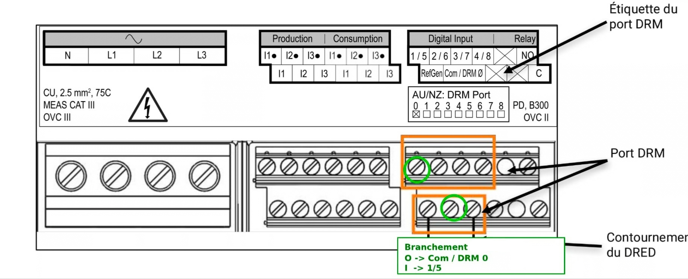
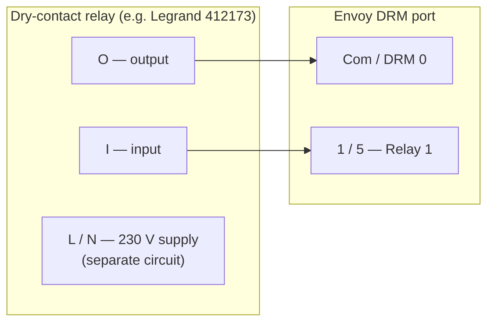
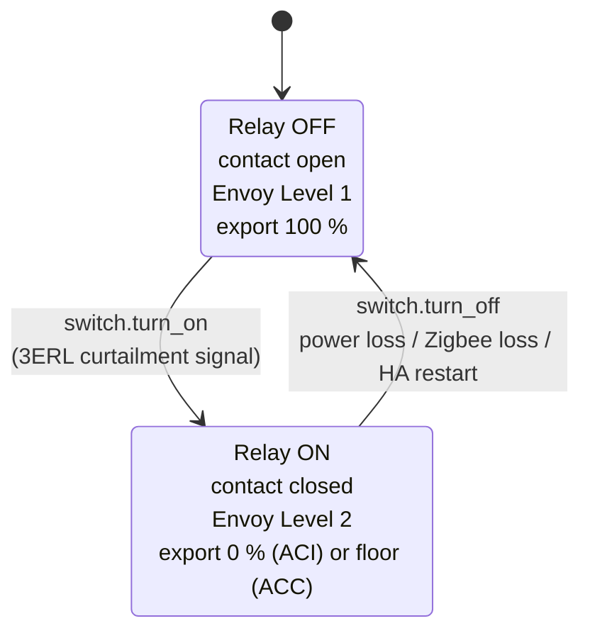

# Wire a dry-contact relay to the Envoy DRM port

Goal: connect a relay so that closing its contact signals the Envoy to limit export.

## Disclaimer

Electrical work should only be performed by a qualified person. Make sure the inverter and AC breakers are off before opening any enclosure. The author and contributors are not responsible for damage or injury.

## Required hardware

- Enphase Envoy-S or IQ Gateway with a DRM port, already configured as described in [Configure the Envoy DRM port](configure-envoy-drm.md).
- A **dry-contact relay** controllable from Home Assistant, for example a Zigbee relay or equivalent.
  - Non-exhaustive list :
    - [Legrand 412173](https://www.zigbee2mqtt.io/devices/412173.html)
    - [ADEO SIN-4-1-20_EQU](https://www.zigbee2mqtt.io/devices/SIN-4-1-20_EQU.html)
    - [some Shelly devices](https://www.shelly.com/fr/collections/smart-switches-dimmers?sort_by=manual&filter.p.m.custom.filter_product_type_2=gid%3A%2F%2Fshopify%2FMetaobject%2F495237431645&filter.p.m.custom.filter_inputs_2=gid%3A%2F%2Fshopify%2FMetaobject%2F495629107549&filter.p.m.custom.filter_outputs_2=gid%3A%2F%2Fshopify%2FMetaobject%2F495652995421&filter.v.price.gte=&filter.v.price.lte=)
- Suitable low-voltage cable (twisted pair or shielded, depending on distance).
- For Zigbee relays, a coordinator compatible with Home Assistant (ZHA, Zigbee2MQTT, deCONZ).

## Locate the DRM port

On the **Envoy-S Metered**, the DRM port is the small terminal block above the main terminals. Look for the **Com / DRM 0** and **1 / 5** labels.

## Wire the relay

The relay's dry contact sits between the `Com` and `1/5` terminals. These are low-voltage digital inputs. Never connect 230 V to them.

With a Legrand 412173:

- **O (output)** → `Com / DRM 0`.
- **I (input)** → `1 / 5` (this pair maps to Relay 1 in the Envoy configuration).
- The C1/C2 auxiliary inputs are not used.
- Power the relay on a separate 230 V circuit. Do not draw power from the DRM port.

For other relay models, connect the two ends of the isolated contact to `Com` and `1/5` in the same way.

Cable notes:

- Keep the run short. For longer runs, use shielded twisted pair and ground the shield at one end only.
- Do not connect the relay supply terminals to the DRM port.

## Set the fail-safe behavior

The contact must be **open** when the system fails, so export falls back to normal.

On the Legrand 412173, set:

- `device_mode` to **switch** (not "auto").
- `power_on_behavior` to **off**, so the contact opens after a power loss.

## Pair the relay with Home Assistant

1. Put your Zigbee coordinator in pairing mode.
2. Power-cycle or reset the relay to enter pairing mode (see the manufacturer instructions).
3. A `switch.*` entity appears in Home Assistant. Note its entity ID, it is required in the [integration setup](install-and-configure.md).

## Verify

1. With the relay off, the Envoy exports normally.
2. Turn the relay switch on. Export drops to the configured Level 2 within a few seconds.
3. Turn the relay off. Export resumes after a short delay.

If the inverter does not react, see [troubleshooting](../troubleshooting.md#export-is-not-limited-when-relay-is-on).

## References

- [Enphase Envoy-S Installation and Operation Manual (PDF)](../assets/enphase/EnvoySMultiphase-IOM-FR.pdf)
- [Enphase Envoy-S Quick Install Guide (PDF)](../assets/enphase/Envoy-S-M-QIG-Multi-Kit-Rev05-FR-2024-01-05.pdf)
- [Enphase Envoy-S Reference Manual (PDF)](../assets/enphase/Envoy-S-MAN-EN-INTL_FR.pdf)
- [Legrand 412173 connected dry-contact switch (PDF)](../assets/legrand/F03387FR-01%20(Contact%20sec%20connect%C3%A9).pdf)
- [Legrand 412173 datasheet (PDF)](../assets/legrand/LE12973AC-FR.pdf)
- [Automatisation-Bridage-3ERL-Emphase](https://github.com/ALP40/Automatisation-Bridage-3ERL-Emphase)
