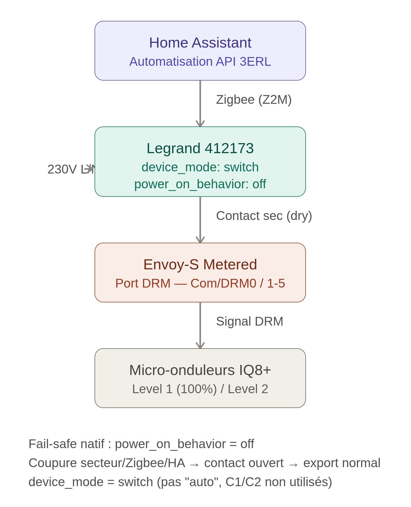

# Wiring the dry-contact relay to the Envoy DRM port

This guide covers the hardware wiring between a Zigbee dry-contact relay and the Enphase Envoy DRM (Distributed Resource Management) port.

## Disclaimer

Electrical work should only be performed by a qualified person. Make sure the inverter and AC breakers are off before opening any enclosure. The author and contributors are not responsible for damage or injury.

## Required hardware

- Enphase Envoy-S or IQ Gateway with a DRM port.
- A Zigbee dry-contact relay module rated for the voltage/current of the DRM port (typically a low-voltage signal).
- Suitable low-voltage cable (twisted pair or shielded, depending on distance).
- A Zigbee coordinator compatible with Home Assistant (ZHA, Zigbee2MQTT, deCONZ, etc.).

## Locate the DRM port on the Envoy

The DRM port is a small terminal block on the Envoy, usually labeled **DRM** or **RS-485**. It exposes a dry-contact input used by the utility or aggregator to signal export limitation. Refer to the Enphase Envoy installation manual for the exact pinout.

Typical pinout (verify with your model):

| Pin | Function |
|-----|----------|
| 1   | DRM+ / Signal |
| 2   | DRM- / Common |
| 3   | Shield/Earth (if present) |

## Relay wiring

The dry-contact relay acts as a simple switch between the two DRM terminals. When the relay is closed, the Envoy sees the DRM signal and reduces export to the configured level (0% for zero-injection).

Example wiring with a **Legrand 412173** Zigbee dry-contact relay:

- **O (output)** → **Com / DRM 0** on the Envoy DRM port.
- **I (input)** → **1 / 5** on the Envoy DRM port.
- Set the relay `device_mode` to **switch** (not "auto").
- Set `power_on_behavior` to **off** so the contact opens on power loss / Zigbee / Home Assistant failure (fail-safe).

The C1/C2 auxiliary inputs are not used in this setup.

- Connect one side of the relay contact to **DRM+**.
- Connect the other side of the relay contact to **DRM-**.
- Do not connect the relay's power supply terminals to the DRM port. Use the relay's dry-contact output only.
- Keep the cable run as short as possible. If the cable must be long, use shielded twisted pair and ground the shield at one end only.

## Power the relay module

Power the Zigbee relay from a separate low-voltage source (for example, the same 12V/24V DC supply used for other automation devices). Do not draw power from the Envoy DRM port.

## Pair with Home Assistant

1. Put your Zigbee coordinator in pairing mode.
2. Reset or power-cycle the relay to enter pairing mode (follow the manufacturer's instructions).
3. Once joined, a `switch.*` entity should appear in Home Assistant.
4. Note the exact entity ID of the switch; it will be required during integration setup.

## Verify the wiring

1. With the relay open, the Envoy should export normally.
2. Turn the relay on from Home Assistant. The Envoy should stop exporting (or reduce export to 0%).
3. Monitor the Envoy production and grid injection values to confirm behavior.

If the inverter does not react immediately, allow a few seconds for the DRM signal to be processed. Some Envoy firmware versions require a specific DRM profile to be enabled.

## References

- [Enphase Envoy-S Installation and Operation Manual (PDF)](assets/enphase/EnvoySMultiphase-IOM-FR.pdf)
- [Enphase Envoy-S Quick Install Guide (PDF)](assets/enphase/Envoy-S-M-QIG-Multi-Kit-Rev05-FR-2024-01-05.pdf)
- [Enphase Envoy-S Reference Manual (PDF)](assets/enphase/Envoy-S-MAN-EN-INTL_FR.pdf)
- [Legrand 412173 connected dry-contact switch (PDF)](assets/legrand/F03387FR-01%20(Contact%20sec%20connect%C3%A9).pdf)
- [Legrand 412173 datasheet (PDF)](assets/legrand/LE12973AC-FR.pdf)
- [Automatisation-Bridage-3ERL-Emphase](https://github.com/ALP40/Automatisation-Bridage-3ERL-Emphase)
